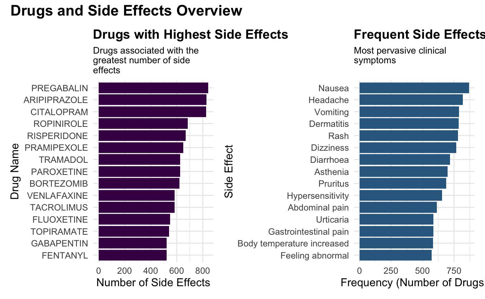
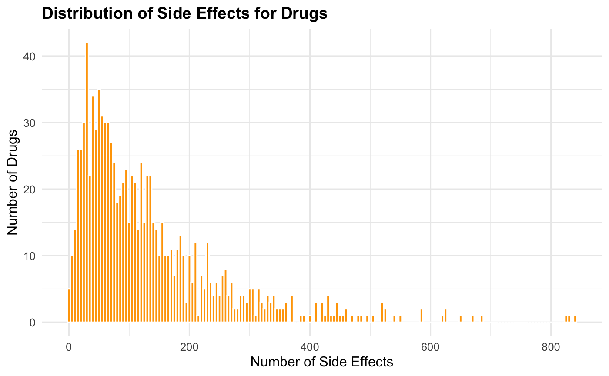
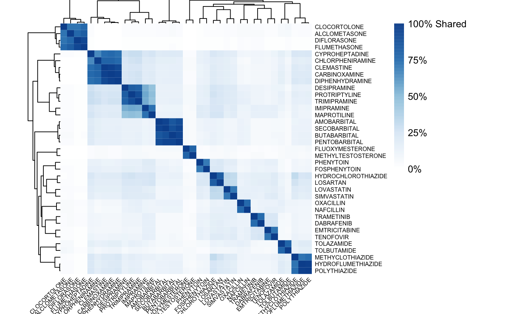
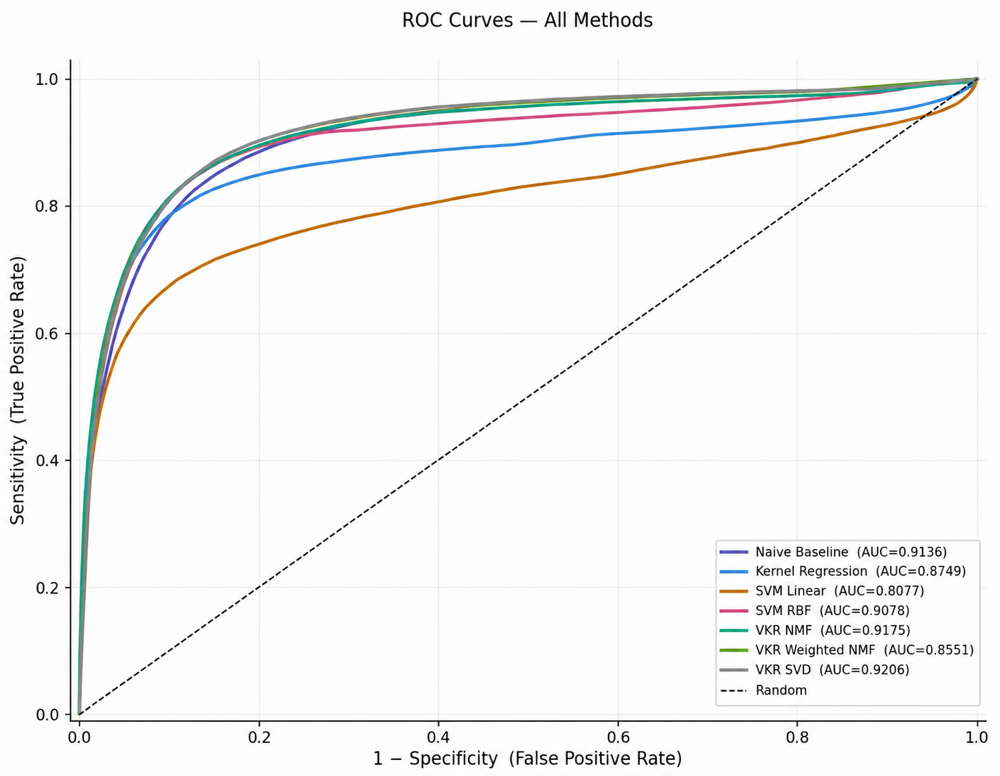
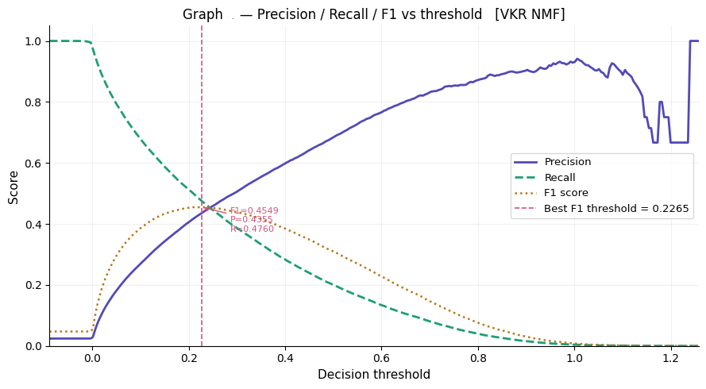
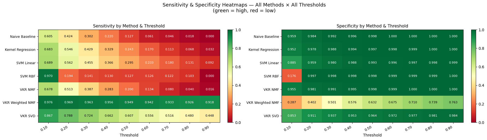
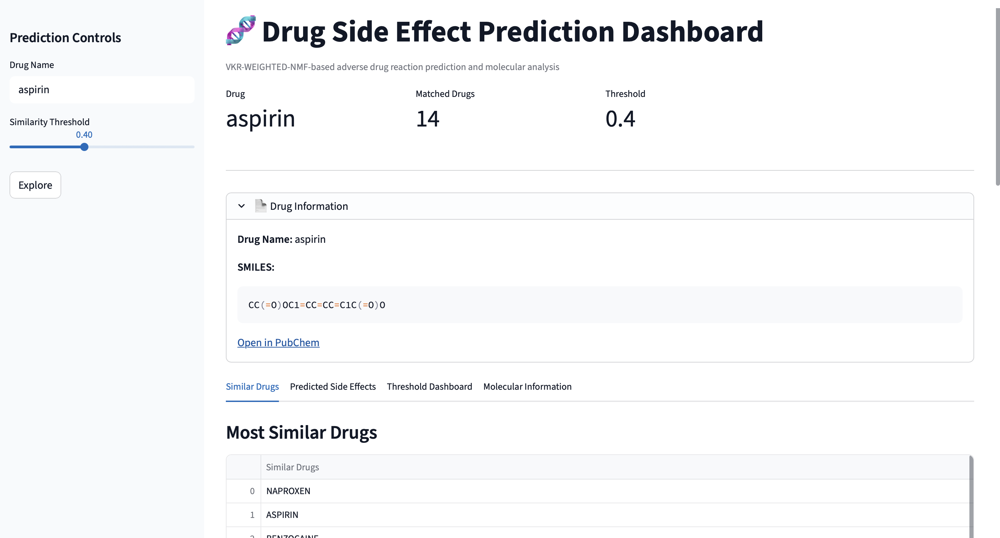
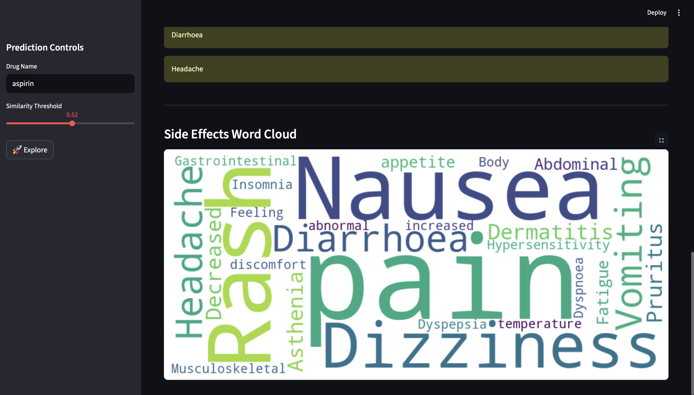

```{r setup, include=FALSE}
knitr::opts_chunk$set(fig.pos = "H")
```

# Introduction

Adverse Drug Reactions (ADRs) are unintended, harmful responses to medications administered at normal therapeutic doses. ADRs are among the leading causes of hospitalisation and morbidity worldwide, with a pooled median prevalence of ADR-related hospital admissions estimated at 6.3% in developed countries and 5.5% in developing countries, based on a systematic review of studies published between 2000 and 2015 [@angamo2016].

Beyond the human cost, ADRs impose substantial financial burdens on healthcare systems. The same European Commission analysis estimated that 197,000 deaths per year in the EU are attributable to ADRs, with a total societal cost of €79 billion as of 2008 [@10.3389/fphar.2018.00350]. Traditional approaches to ADR detection rely primarily on post market pharmacovigilance, monitoring drug safety signals after a drug has already entered clinical use. While these methods are effective, someone must experience an adverse reaction in real life to flag such behaviour. Hence, computational prediction of ADRs, offers the potential to anticipate safety issues before clinical exposure, informing drug development decisions and personalising treatment.

Drugs can be characterised by their interaction profiles with genes and by their chemical structure, both of which are expected to carry information about their biological activity and, by extension, their side effect profiles. Therefore, the drug gene profiles and chemical structure were used as primary inputs for the model in predicting ADR’s. However, the construction of such models faces two fundamental statistical challenges:

1. **Sparsity**: The drug side effect matrix is extremely sparse. Most drug side effect pairs are unobserved, not because the side effect is absent, but because it has not been reported or studied.

2. **Class Imbalance**: The number of known positive drug side effect associations is vastly smaller than the number of negatives, making standard classifiers biased toward predicting the majority (negative) class.

The Area Under the Receiver Operating Characteristic curve (AUROC) is a widely used metric that quantifies a classifier's ability to discriminate between positive and negative classes across all classification thresholds, calculated as the area under the curve plotting the true positive rate (sensitivity) against the false positive rate (1 - specificity). However, the ADR dataset possess a highly imbalanced classes where positive cases are rare relative to the negative cases. 

The Area Under the Precision Recall Curve (AUPR) plots, precision (the proportion of predicted positives that are true positives) against recall (the proportion of actual positives correctly identified) across all thresholds. Since precision is sensitive to number of false positives, AUPR provides a more informative and discriminative assessment of the model performance. So, both AUPR and AUROC has been evaluated for all the models. In this study, AUPR is used as the main evaluation metric, while AUROC is reported as a secondary measure. 

Early methodologies primarily relied on chemical substructures mapped via Ordinary Canonical Correlation Analysis (OCCA) [@pauwels2011predicting] or multiple kernel regression frameworks to integrate chemical structures and protein targets [@yamanishi2012prediction]. While classical classifiers like Support Vector Machines (SVM) and Random Forests have historically dominated the field [@seo2020deep], their performance often degrades significantly when subjected to highly imbalanced drug-ADR datasets, occasionally falling short of simple frequency-based naïve baselines. To mitigate the noise and sparsity inherent to these imbalanced datasets, [@10.1093/bioadv/vbae009] introduced a hybrid framework (VKR) combining Non-Negative Matrix Factorization (NMF) with Kernel Regression, leveraging dimension reduction to extract latent representations.

While the standard NMF approach by Zhong et al. effectively captures underlying drug-ADR patterns, it treats all missing or negative associations uniformly, potentially overlooking variations in data quality and feature reliability. To address this limitation, this study replicates their foundational framework and explicitly extends it by introducing a novel Weighted Non-Negative Matrix Factorization (WNMF) method. Unlike standard NMF, our weighted variation applies dynamic confidence metrics to individual entries, optimizing the reconstruction process for drug-gene interaction (DGI) profiles and chemical fingerprints. 

Furthermore, we expand the original data scope by 25%, integrating the latest records from the SIDER and DGIdb databases to encompass a cohort of 973 drugs, thereby allowing us to rigorously validate the scalability and predictive precision of the Weighted NMF framework.

In the remainder of this paper, Section 2 describes the datasets, Section 3 methods, followed by results and discussions.


# Data

The primary data for this study was accessed through various publicly available sources. In particular, the SIDER 4.1 database was used to obtain drug side-effect information. SIDER ("Side Effect Resource") is a publicly available database that compiles information on marketed drugs and their recorded adverse drug reactions, extracted from package inserts and clinical trial data. The current release contains data on 1,430 drugs, 5,880 ADRs, and 140,064 drug–ADR pairs [@kuhn2016sider]. 

Additionally, the Drug–Gene Interaction Database (DGIdb 4.0) was used to obtain drug–gene interaction data. DGIdb is a web resource that aggregates information on drug–gene interactions and druggable genes from publications, databases, and other web-based sources, with drug, gene, and interaction data normalised and merged into conceptual groups [@freshour2021dgidb]. 

PubChem, a freely accessible chemical database maintained by the National Center for Biotechnology Information (NCBI), was used to retrieve drug chemical structure fingerprints. Mapping the drug names to side effects, gene interactions, and chemical fingerprints resulted in 973 unique data points across the three databases. Table 1 provides an overview of the dimensionality of the three databases.

All three datasets were binarised (binary matrices) prior to modelling. The DGI and Chemical fingerprints data had all the drugs in the first column. Genes and generated fingerprints were presented in each columns in the respective datasets.

| Feature Type          | Dimensionality |
|-----------------------|---------------|
| Drug-Gene Interaction | 973 × 3,647   |
| Chemical Fingerprints | 973 × 1,024   |
| Side Effect Matrix    | 973 × 5779    |

Table: Summary of dataset dimensions.

## Class Imbalance in the dataset

The drug side effect matrix is highly sparse, with a positive rate well below 10% for most side effects. This severe class imbalance motivates the use of AUPR as a primary evaluation metric alongside AUROC, since AUROC can appear inflated in imbalanced settings. In the entire dataset, about 97% of the data represents the negative class and remaining as positive class

# Methods

Exploratory data analysis, comprising descriptive statistics and heatmap visualisation, was initially conducted to characterise the most prevalent side effects and to examine drug similarity structures and class imbalance within the ADR dataset. Subsequently, six modelling approaches of increasing methodological complexity were employed to predict ADR associations. Each model utilises the drug–gene interaction (DGI) matrix, the chemical fingerprint matrix, or a combination of both as input, and outputs a predicted probability score for each drug–side effect pair. 5-fold cross validation was performed to assess the predictive ability of the proposed models. Due to high sparsity of the drug side effect matrix (with a positive rate well below 10% for most side effects), AUPR was used as a primary evaluation metric alongside AUROC, since AUROC can appear inflated in imbalanced settings. 

Below we briefly discuss the proposed modelling approaches. 


1.	**Naïve Baseline**
The Naïve Baseline assigns to each drug-side effect pair the marginal prevalence of that side effect across the training set. This model ignores the drug gene interaction and chemical fingerprints data, and predicts probability based on the prevalence of side effects among the given dataset.

2.	**Kernel Regression**
Kernel Regression (KR) operates by mapping drugs into a high dimensional similarity space. For a new drug (d), its side effect probabilities are predicted as a weighted average of training drugs' side effect profiles, where weights are proportional to their similarity to new drug (d). This model projects the new drug into the same high-dimensional space as the training drugs and predicts its side effects based on its position in that space.

3.	**Support Vector Machine (SVM)**
The SVM models treat ADR prediction as a binary classification problem, training a separate classifier per side effect. We evaluated two kernel configurations:
SVM-Linear: A linear SVM in the feature space, appropriate when the number of features exceeds the number of samples.
SVM-RBF: An SVM with a Radial Basis Function (RBF) kernel, which maps the data into an infinite-dimensional feature space and finds a maximum-margin hyperplane there.

4.	**Non-negative Matrix Factorisation with Kernel Regression (VKR NMF)**
Non-negative Matrix Factorisation (NMF) decomposes the training side effect matrix into two lower-rank non-negative matrices:
$$Y \approx UH^\top, \quad U \in \mathbb{R}^{n \times k}_+, \quad H \in \mathbb{R}^{s \times k}_+$$
where min(n,s) is the number of latent features. The matrix ‘U’ captures the drug level latent representation (side effect profiles in latent space), and ‘H’ captures the side effect level loadings.
For prediction, Kernel Regression is applied to project new drugs into the latent space:

$$\hat{U}_{d^*} = K(d^*, D_{\text{train}}) W$$

where ‘W’ is a weight matrix learned by regressing ‘U’ onto the kernel matrix. The predicted side effects are then reconstructed as:

$$\hat{Y}_{d^*} = \hat{U}_{d^*} H^\top$$

This approach captures latent structure in the side effect matrix while leveraging drug similarity for prediction.

5.	**Weighted NMF with Kernel Regression (VKR Weighted NMF)**
Standard NMF treats all entries of ‘Y’ equally, which is problematic given sparsity and class imbalance. Weighted NMF addresses this by upweighting observed positive entries in the factorisation objective:

$$\min_{U \geq 0, H \geq 0} \sum_{i,j} W_{ij} \left(Y_{ij} - [UH^\top]_{ij}\right)^2$$
where $W_{ij} > 1$ for observed positive pairs and $W_{ij} = 1$ otherwise. This encourages the model to accurately reconstruct the rare positive associations that are most predictively valuable.
Kernel Regression is then applied as in the standard NMF case to project new drugs. This model is designed specifically to address the imbalance problem, prioritising precision on positive predictions.
The penalty factor of 1:10 is applied, for predicting all true outcomes wrongly. Since the dataset is imbalanced, this penalty enforces the model to predict the true positives correctly. This is the novel model that is introduced to increase


# Results

Exploratory data analysis (EDA) was performed on the dataset to characterise key structural properties of the ADR data. Figure 1 presents the drugs associated with the largest number of reported side effects. The results indicate that a relatively small number of ADRs account for a substantial proportion of all reported events, reflecting a highly skewed distribution of side effects. The drugs exhibiting the highest side-effect counts predominantly act on the central nervous system (CNS), which likely accounts for their disproportionately large number of associated adverse reactions.
```{r fig-most-common-drug, echo=FALSE, fig.cap="Drugs with most number of side effects and most frequent side effects\\label{fig:fig-most-common-drug}", out.width="70%", fig.align="center"}


```
Figure 2 illustrates the distribution of the number of side effects associated with each drug. Several drugs are associated with more than 200 side effects, while a small subset is associated with as many as 800, further underscoring the heterogeneity of side-effect burden across drugs.
```{r fig-se-distribution, echo=FALSE, fig.cap="Distribution of side effects", out.width="70%", fig.align="center"}


```
Given that the majority of the proposed models rely on similarity between drug profiles, Figure 3 presents a heatmap illustrating drug similarity based on shared side-effect profiles. Distinct clustering patterns are observed, suggesting that subsets of drugs share similar adverse reaction profiles. The heatmap further demonstrates the sparsity of the underlying interaction matrix, with positive drug–side effect associations representing only a small fraction of all possible combinations. Collectively, these visualisations highlight the heterogeneous nature of ADR profiles and the pronounced class imbalance characteristic of the prediction task.

```{r fig-se-heatmap, echo=FALSE, fig.cap="Drug Similarity Heatmap", out.width="70%", fig.align="center"}

```

Table 2 summarises the predictive performance of all evaluated methods using a single random 75% training and 25% testing split. Performance is reported in terms of the Area Under the Receiver Operating Characteristic Curve (AUROC) and the Area Under the Precision–Recall Curve (AUPR), with the highest average value for each metric highlighted.

```{r, echo=FALSE, include=FALSE, warning=FALSE, message=FALSE}
library(knitr)

results_summary <- data.frame(
  Method = c(
    "Naïve Baseline",
    "Kernel Regression",
    "SVM Linear",
    "SVM RBF",
    "VKR NMF",
    "VKR Weighted NMF",
    "VKR SVD"
  ),

  Mean_AUROC_SD = c(
    "0.9101 ± 0.0024",
    "0.8745 ± 0.0051",
    "0.7955 ± 0.0097",
    "0.9001 ± 0.0041",
    "\\textbf{0.9183 ± 0.0027}",
    "0.8551 ± 0.0035",
    "0.9098 ± 0.0033"
  ),

  MeanAUPR_SD = c(
    "0.3584 ± 0.0075",
    "0.4155 ± 0.0051",
    "0.3122 ± 0.0124",
    "0.3919 ± 0.0068",
    "0.4230 ± 0.0033",
    "\\textbf{0.5001 ± 0.0022}",
    "0.4341 ± 0.0049"
  )
)

kable(
  results_summary,
  caption = "Predictive performance of all evaluated methods using a single 75% training and 25% testing split (AUROC and AUPR)",
  caption.placement = "Bottom"
)
```

Among all evaluated approaches, VKR NMF achieved the highest mean AUROC (0.9183 ± 0.0027) together with a mean AUPR of 0.4230 ± 0.0033, indicating the strongest overall discrimination between positive and negative ADR associations. VKR Weighted NMF produced the highest mean AUPR (0.5001 ± 0.0022), while achieving a mean AUROC of 0.8551 ± 0.0035. VKR SVD also demonstrated strong and consistent performance across all five folds, obtaining a mean AUROC of 0.9098 ± 0.0033 and a mean AUPR of 0.4341 ± 0.0049. The Naïve Baseline achieved the second-highest mean AUROC (0.9101 ± 0.0024), although its mean AUPR (0.3584 ± 0.0075) was considerably lower than those of the VKR-based methods. Kernel Regression and SVM RBF demonstrated intermediate performance across both evaluation metrics, whereas SVM Linear produced the lowest overall predictive performance, with a mean AUROC of 0.7955 ± 0.0097 and a mean AUPR of 0.3122 ± 0.0124.

Figure 4 presents the variation of precision, recall, and F1 score for the VKR NMF model across different decision thresholds. As the decision threshold increases, recall decreases while precision generally increases, illustrating the trade-off between identifying true ADR associations and reducing false positive predictions. The F1 score, which balances precision and recall, reaches its maximum value of 0.4549 at a threshold of 0.2265, corresponding to a precision of 0.4355 and a recall of 0.4760. The optimal threshold is considerably lower than the conventional value of 0.5, indicating that a lower decision boundary provides a more balanced prediction performance for this highly imbalanced ADR dataset.

```{r fig-roc, echo=FALSE, fig.cap="ROC Curve for all methods", out.width="70%", fig.align="center"}

```

Figure 5 presents the Receiver Operating Characteristic (ROC) curves for all evaluated methods. VKR NMF achieved the strongest overall discrimination between positive and negative ADR associations, producing the highest AUROC among all evaluated approaches. VKR SVD and the Naïve Baseline also demonstrated competitive ROC performance, whereas SVM Linear exhibited the weakest discrimination.
```{r fig-precision-recall, echo=FALSE, fig.cap="Precision Recall Curve", out.width="70%", fig.align="center"}

```

Figure 6 presents the sensitivity and specificity of each evaluated method across decision thresholds ranging from 0.1 to 0.9. The heatmaps illustrate each model's ability to correctly identify true ADR associations (sensitivity) while correctly rejecting negative associations (specificity).
Most models follow the expected pattern in which sensitivity decreases as the decision threshold increases, while specificity increases. The Naïve Baseline, Kernel Regression, SVM variants, VKR NMF, and VKR SVD all exhibit high sensitivity at lower thresholds, followed by a gradual decline as more stringent decision boundaries are applied. By a threshold of 0.5, sensitivity for these models has decreased substantially, whereas specificity exceeds 0.99, indicating a strong ability to avoid false positive predictions.
In contrast, VKR Weighted NMF displays a markedly different behaviour. Across the entire threshold range, it maintains substantially higher sensitivity than the remaining methods, achieving 0.976 at a threshold of 0.1 and remaining at 0.918 even at a threshold of 0.9. This high sensitivity is accompanied by comparatively lower specificity, which increases from 0.287 at threshold 0.1 to 0.763 at threshold 0.9. The heatmaps therefore demonstrate the distinct operating characteristics of VKR Weighted NMF relative to the other evaluated approaches.

```{r fig-heatmap, echo=FALSE, fig.cap="Sensitivity and specificity heatmaps across all methods and decision thresholds (0.1–0.9). Green indicates higher values, whereas red indicates lower values.", out.width="100%", fig.align="center"}

```

To evaluate the consistency of the results across different data partitions, an additional five-fold cross-validation was conducted independently of the hold-out evaluation
```{r, echo=FALSE}
library(knitr)

auroc_full <- data.frame(
  Method = c(
    "Naïve Baseline",
    "Kernel Regression",
    "SVM Linear",
    "SVM RBF",
    "VKR NMF",
    "VKR Weighted NMF",
    "VKR SVD"
  ),

  F1 = c(0.9089, 0.8676, 0.7828, 0.8969, 0.9158, 0.8510, 0.9051),
  F2 = c(0.9078, 0.8727, 0.8003, 0.8974, 0.9163, 0.8533, 0.9072),
  F3 = c(0.9083, 0.8718, 0.8000, 0.9018, 0.9165, 0.8600, 0.9106),
  F4 = c(0.9116, 0.8787, 0.7857, 0.8970, 0.9204, 0.8587, 0.9118),
  F5 = c(0.9142, 0.8819, 0.8087, 0.9074, 0.9226, 0.8527, 0.9143),

  Mean_SD = c(
    "0.9101 ± 0.0024",
    "0.8745 ± 0.0051",
    "0.7955 ± 0.0097",
    "0.9001 ± 0.0041",
    "0.9183 ± 0.0027",
    "0.8551 ± 0.0035",
    "0.9098 ± 0.0033"
  )
)

kable(auroc_full, caption = "AUROC scores across five folds with mean ± standard deviation")
```

Table 3 presents the five-fold cross-validation results for all evaluated methods, reporting AUROC scores for each fold along with their mean and standard deviation.

```{r, echo=FALSE}
aupr_full <- data.frame(
  Method = c(
    "Naïve Baseline",
    "Kernel Regression",
    "SVM Linear",
    "SVM RBF",
    "VKR NMF",
    "VKR Weighted NMF",
    "VKR SVD"
  ),

  F1 = c(0.3615, 0.4151, 0.3156, 0.3945, 0.4241, 0.5004, 0.4338),
  F2 = c(0.3674, 0.4228, 0.3243, 0.4030, 0.4282, 0.5006, 0.4427),
  F3 = c(0.3485, 0.4090, 0.3225, 0.3860, 0.4182, 0.4960, 0.4292),
  F4 = c(0.3641, 0.4110, 0.2902, 0.3923, 0.4212, 0.5025, 0.4296),
  F5 = c(0.3506, 0.4194, 0.3085, 0.3836, 0.4233, 0.5010, 0.4353),

  Mean_SD = c(
    "0.3584 ± 0.0075",
    "0.4155 ± 0.0051",
    "0.3122 ± 0.0124",
    "0.3919 ± 0.0068",
    "0.4230 ± 0.0033",
    "0.5001 ± 0.0022",
    "0.4341 ± 0.0049"
  )
)

kable(aupr_full, caption = "AUPR scores across five folds with mean ± standard deviation")
```
Table 4 presents the five-fold cross-validation results for all evaluated methods, reporting AUPR scores for each fold along with their mean and standard deviation.  

Across the five folds, VKR Weighted NMF achieved the highest mean AUPR (0.5001 ± 0.0022), clearly outperforming all other evaluated methods in terms of precision–recall performance, while maintaining a competitive AUROC of 0.8551 ± 0.0035. VKR NMF achieved the highest mean AUROC (0.9183 ± 0.0027), together with a mean AUPR of 0.4230 ± 0.0033, indicating strong overall discrimination. VKR SVD also demonstrated consistently strong performance, with a mean AUROC of 0.9098 ± 0.0033 and a mean AUPR of 0.4341 ± 0.0049.
In comparison, the Naïve Baseline achieved a mean AUROC of 0.9101 ± 0.0024 but a substantially lower mean AUPR of 0.3584 ± 0.0075, indicating weaker performance under imbalanced conditions. Kernel Regression obtained a mean AUROC of 0.8745 ± 0.0051 and a mean AUPR of 0.4155 ± 0.0051, while SVM RBF achieved 0.9001 ± 0.0041 and 0.3919 ± 0.0068 respectively. SVM Linear recorded the lowest performance overall, with a mean AUROC of 0.7955 ± 0.0097 and a mean AUPR of 0.3122 ± 0.0124.

## An Interactive Application for ADR Prediction

```{r fig-app, echo=FALSE, fig.cap="Interactive Application For ADR Prediction", out.width="70%", fig.align="center"}


```
Figure 7 and 8, displays a snapshot of an interactive web application allowing users to input a drug and receive a ranked list of predicted adverse drug reactions from the best-performing model. The app can be run locally where the code, datasets, and deployment steps are all available in the paper’s. [GitHub repository](https://github.com/arshad4387/ADR-Prediction)


# Discussion

Adverse drug reactions cause significant patient harm and represent a major public health concern in pharmacovigilance and drug safety research, as they are frequently associated with hospitalisation and serious clinical outcomes [@Lazarouetal1998]. Being able to predict them computationally before a drug reaches widespread clinical use is therefore an important goal in drug safety research. This study set out to evaluate whether a range of statistical and machine learning methods, drawing on drug–gene interaction profiles, chemical fingerprints, and side-effect similarity, could predict adverse drug reaction associations in a robust and interpretable manner. The results demonstrate that this is feasible, while also highlighting important challenges in the evaluation of ADR prediction models.

A key point from this work is that choosing the right evaluation metric is especially important for highly imbalanced biomedical datasets. This is because the dataset contains far more negative drug–reaction pairs than positive ones. The Area Under the Receiver Operating Characteristic curve (AUROC) is a widely used metric that quantifies a classifier's ability to discriminate between positive and negative classes across all classification thresholds, calculated as the area under the curve plotting the true positive rate (sensitivity) against the false positive rate (1 - specificity).

The Area Under the Precision Recall Curve (AUPR) plots, precision (the proportion of predicted positives that are true positives) against recall (the proportion of actual positives correctly identified) across all thresholds. Since precision is sensitive to number of false positives, AUPR provides a more informative and discriminative assessment of the model performance. So, both AUPR and AUROC has been evaluated for all the models. In this study, AUPR is used as the main evaluation metric, while AUROC is reported as a secondary measure. 

The Naïve Baseline clearly shows this effect: although it achieves an AUROC of over 0.91 without using any meaningful drug-specific information, its AUPR is only 0.36, indicating poor performance in identifying the rare positive cases. This difference suggests that AUROC can sometimes give an overly optimistic impression of performance when classes are highly imbalanced, while AUPR provides a more realistic view of how well the model performs in practice. This finding is consistent with previous work showing that precision–recall based evaluation is more appropriate than ROC analysis in imbalanced settings [@SaitoandRehmsmeier2015].

The difference between VKR NMF and VKR Weighted NMF reflects the basic trade-off between sensitivity and specificity in ADR prediction. In pharmacovigilance, methods that prioritise sensitivity are often used in early-stage safety screening so that potential signals are not missed, even if that means more false positives. In contrast, methods that focus on higher specificity are more suitable for confirmatory analysis, where the goal is to reduce false alarms and improve confidence in the detected associations. This balance between catching as many true signals as possible and keeping results reliable is a well-known consideration in pharmacovigilance practice [@Pauletal2010].

The threshold analysis further illustrates a well-established characteristic of imbalanced classification problems: the conventional default threshold of 0.5 is often not appropriate for imbalanced ADR datasets. For VKR NMF, the optimal F1 score is achieved at a threshold of 0.2265, which is substantially lower than the default. At this operating point, the model achieves a more balanced trade-off between precision and recall. This indicates that models trained on imbalanced biomedical data may produce biased probability estimates for positive cases, highlighting the importance of threshold calibration when translating predicted probabilities into class labels. Using a default threshold such as 0.5 may lead to reduced sensitivity in detecting positive cases under class imbalance [@malone2018].

From a modelling perspective, the multi-source feature integration approach used in this study seems to work well. Drug–gene interactions, chemical fingerprints, and side-effect mappings each capture different and complementary aspects of drug behaviour. The improvement in AUPR from the Naïve Baseline to the VKR-based models suggests that these features contain real biological signal rather than just statistical patterns. In particular, latent factorisation methods like VKR NMF are able to effectively use these heterogeneous inputs, showing that the learned representation space is informative for predicting adverse drug reactions. An important contribution of the present study is that it builds upon and extends the framework proposed by [@10.1093/bioadv/vbae009], who demonstrated the effectiveness of combining non-negative matrix factorisation with kernel regression for adverse drug reaction prediction using heterogeneous biological information. While their work established the value of latent factorisation techniques, the current study broadens this approach by evaluating an extended set of biological features, including drug–gene interaction profiles, chemical fingerprints, and side-effect similarity, within a comprehensive comparative framework. In addition, because ADR prediction is a highly imbalanced classification problem, model performance was evaluated primarily using the area under the precision–recall curve (AUPR), while AUROC was reported as a complementary measure. Threshold optimisation was also incorporated into the modelling process to select decision thresholds appropriate for the imbalanced setting. The results obtained are broadly consistent with those of [@10.1093/bioadv/vbae009], confirming that latent factorisation remains an effective strategy for ADR prediction, while also demonstrating that careful evaluation under imbalanced conditions provides a more realistic assessment of model performance. Together, these methodological refinements and the accompanying interactive implementation represent a practical extension of previous work and contribute to the development of more interpretable and clinically relevant computational pharmacovigilance tools.

Despite these positive results, several limitations should be acknowledged. First, the current framework focuses exclusively on single-drug adverse reactions and does not account for drug-drug interactions, which are known to contribute significantly to real-world adverse events [@Dechanontetal2014]. Second, performance may degrade for novel drugs with limited structural similarity or sparse interaction data, since similarity-based approaches rely on sufficient neighbourhood information for generalisation. Third, the training data is derived from pharmacovigilance databases that are inherently biased toward well-studied drugs and frequently reported reactions, introducing reporting bias that may inflate performance on common drug classes while limiting generalisability [@HaubenZhou2003].

There are several promising directions for future work. Graph neural networks represent a promising extension of the current framework because they can model drug–protein, protein–protein, and drug–drug interactions within a multimodal graph structure. For example, the Decagon framework proposed by Zitnik et al. constructs a graph comprising protein–protein interactions, drug–protein target interactions, and polypharmacy side effects, and applies graph convolutional neural networks for multirelational link prediction [@Zitniketal2018]. Extending the current framework to drug–drug interaction prediction would also significantly increase its clinical relevance. In addition, integrating continuously updated pharmacovigilance databases would help address temporal drift in drug safety data and improve robustness over time. Finally, incorporating additional replicate datasets and cross-source validation would help reduce dataset-specific bias and improve generalisability across drug classes

Overall, this study establishes a strong and interpretable baseline framework for ADR prediction with a rigorous evaluation strategy that explicitly accounts for class imbalance. By prioritising AUPR as the main evaluation metric and treating threshold selection as a core modelling decision, the work provides a more realistic assessment of predictive performance than approaches that rely primarily on AUROC. The resulting system is not only analytically robust but also practically usable through the accompanying interactive application, and it provides a solid foundation for future extensions in computational drug safety prediction.

# References